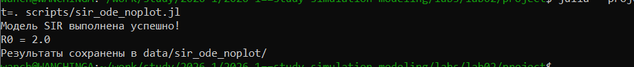
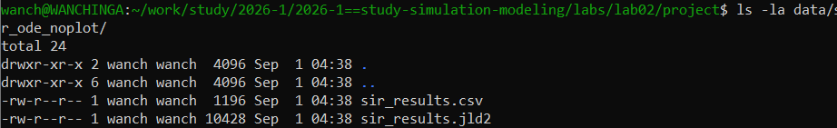
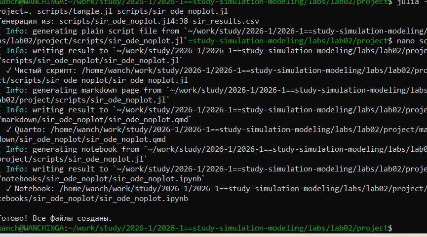
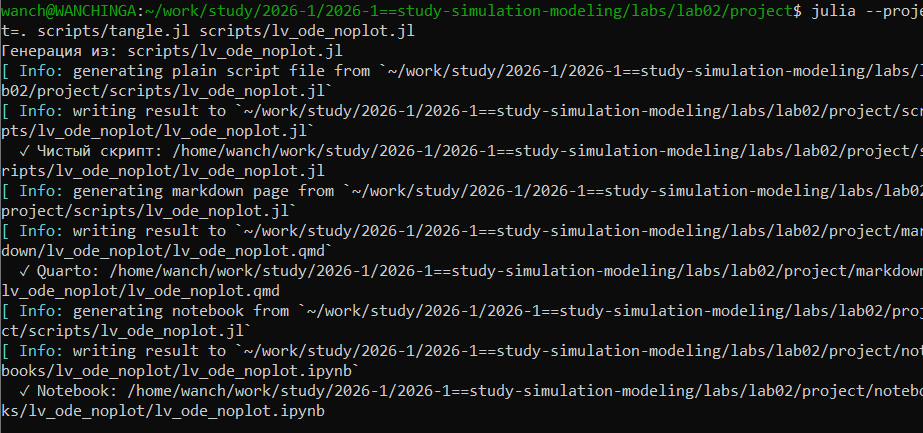
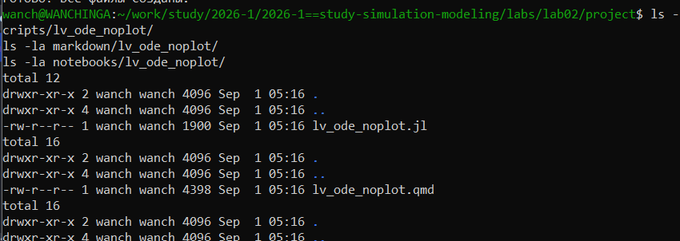
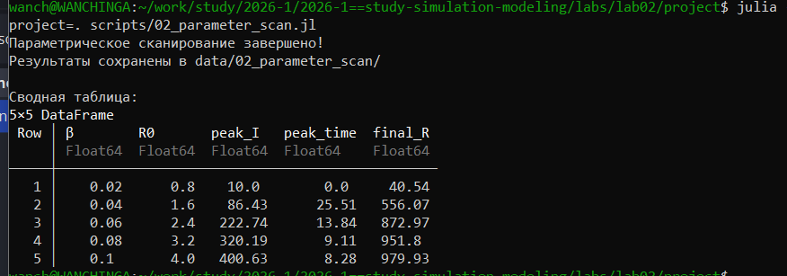

[---
title: "Лабораторная работа №2: Модели SIR и Лотки-Вольтерры"
author: "David Wanchinga"
date: "2026-09-01"
format: beamer
---

# Цель работы

Изучить модели SIR и Лотки-Вольтерры.

# Задание

1. Реализовать модель SIR.
2. Реализовать модель Лотки-Вольтерры.
3. Провести параметрическое сканирование.

# Выполнение лабораторной работы

## Запуск модели SIR

{#fig-001 width=70%}

## Результаты модели SIR

{#fig-002 width=70%}

## Все файлы успешно созданы

{#fig-003 width=70%}

## Генерация чистого скрипта, Quarto и Jupyter Notebook

{#fig-005 width=70%}

## Сгенерированные файлы для модели Лотки-Вольтерры

{#fig-006 width=70%}

## Результаты параметрического сканирования

{#fig-007 width=70%}

# Выводы

Реализованы модели SIR и Лотки-Вольтерры. Проведено параметрическое сканирование.]
