# Цель работы

Изучить агентную модель Daisyworld, демонстрирующую саморегуляцию планетарной температуры через взаимодействие черных и белых маргариток.

# Задание

1. Реализовать модель Daisyworld с использованием Agents.jl.
2. Провести визуализацию модели на разных шагах.
3. Создать анимацию эволюции модели.
4. Построить графики динамики популяции и температуры.
5. Провести параметрическое сканирование.

# Выполнение лабораторной работы

## Запуск модели Daisyworld

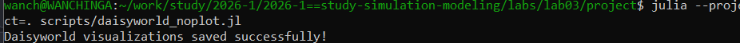{#fig-001 width=70%}

## Сгенерированные изображения Daisyworld

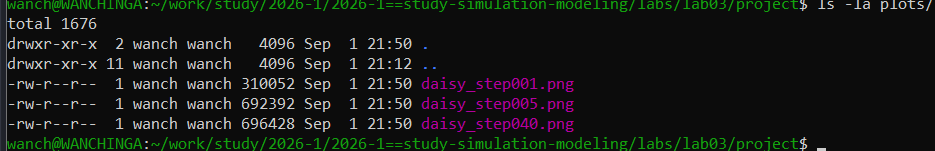{#fig-002 width=70%}

## Визуализация Daisyworld (шаг 1)

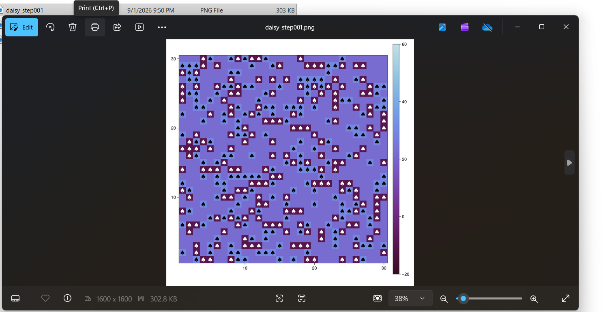{#fig-003 width=70%}

## Визуализация Daisyworld (шаг 5)

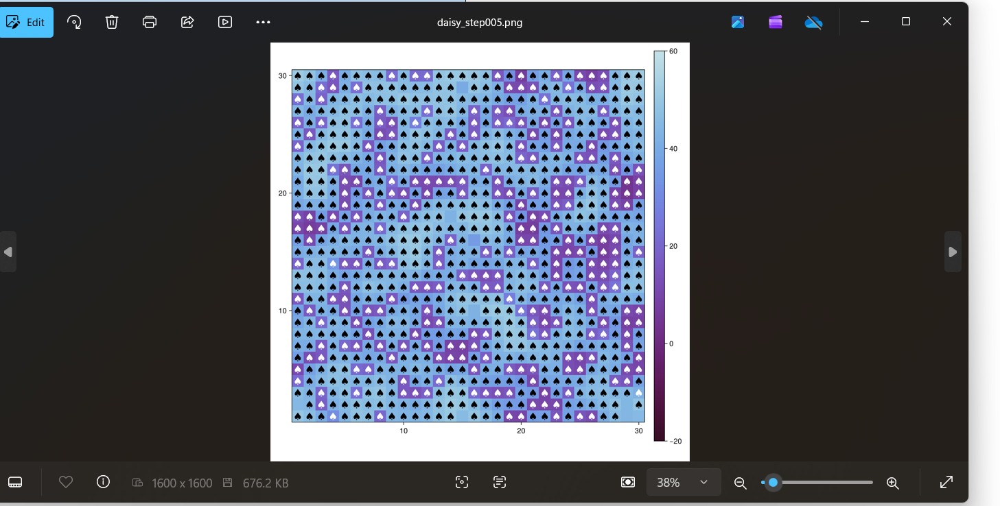{#fig-004 width=70%}

## Визуализация Daisyworld (шаг 40)

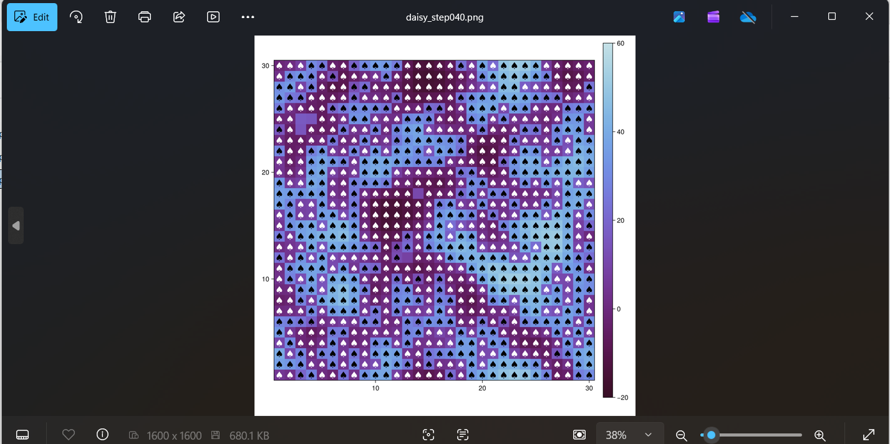{#fig-005 width=70%}

## Сгенерированные файлы визуализации

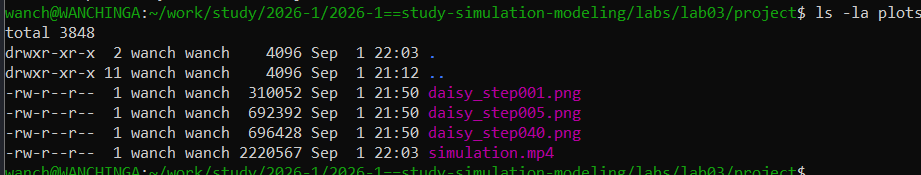{#fig-006 width=70%}

## Запуск скрипта динамики популяции

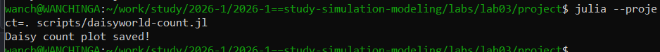{#fig-007 width=70%}

## Запуск скрипта динамики температуры и светимости

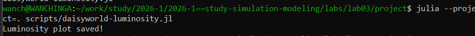{#fig-008 width=70%}

## Все сгенерированные файлы визуализации

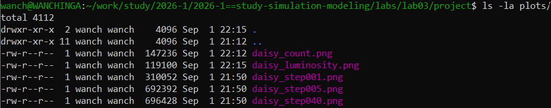{#fig-009 width=70%}

## Результаты параметрического сканирования

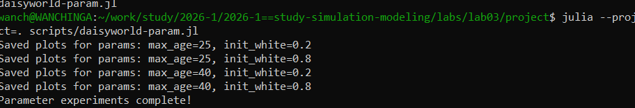{#fig-010 width=70%}

## Все файлы успешно созданы

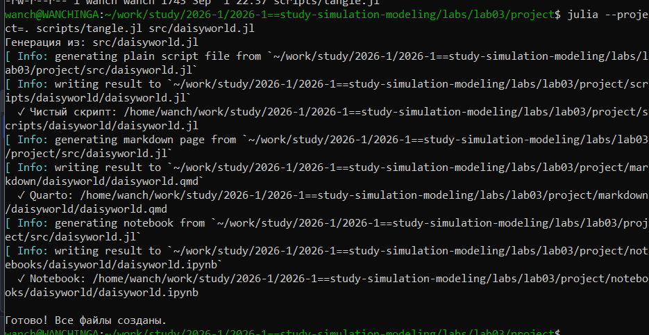{#fig-011 width=70%}

# Выводы

В ходе лабораторной работы была реализована агентная модель Daisyworld на языке Julia с использованием пакета Agents.jl. Проведена визуализация модели на разных шагах (1, 5, 40), создана анимация эволюции, построены графики динамики популяции черных и белых маргариток, а также динамики средней температуры и солнечной светимости.

Выполнено параметрическое сканирование с изменением максимального возраста маргариток (25 и 40) и начальной доли белых маргариток (0.2 и 0.8). Результаты подтверждают устойчивость модели к изменениям параметров и способность к саморегуляции.

Модель Daisyworld наглядно демонстрирует механизм отрицательной обратной связи между живыми организмами и окружающей средой, поддерживающий температуру в диапазоне, благоприятном для жизни.

