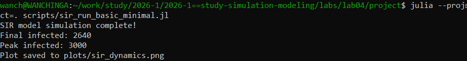
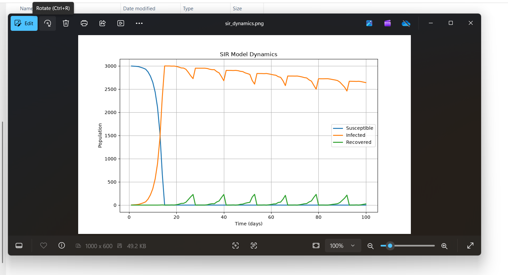
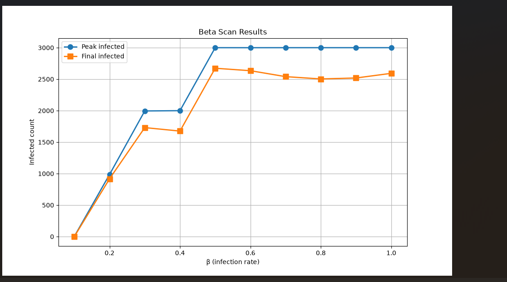

# Цель работы

Изучить агентную модель распространения инфекции SIR.

# Задание

1. Реализовать агентную модель SIR
2. Провести базовую симуляцию
3. Исследовать влияние параметра β

# Базовая симуляция

{#fig-001 width=70%}

# Динамика SIR

{#fig-002 width=70%}

# Параметрическое сканирование

{#fig-003 width=70%}

# Результаты сканирования

{#fig-004 width=70%}

# График результатов

{#fig-005 width=70%}

# Выводы

- Реализована агентная модель SIR
- Проведено параметрическое сканирование β
- При β < 0.2 эпидемия не развивается