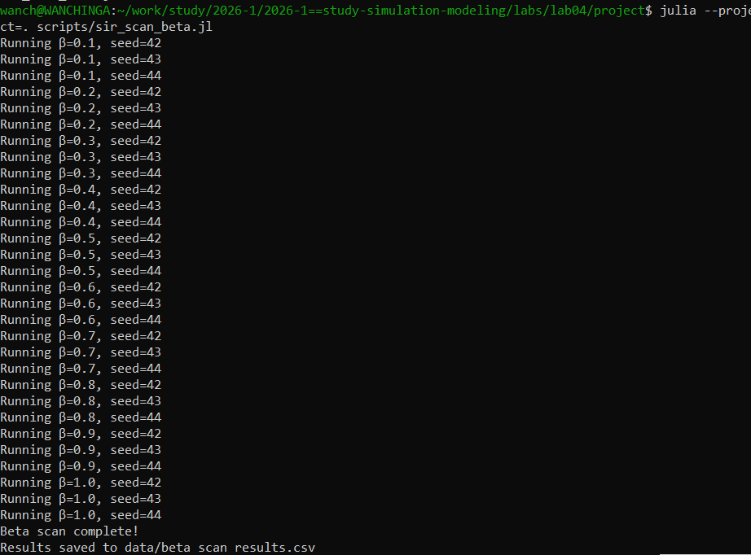
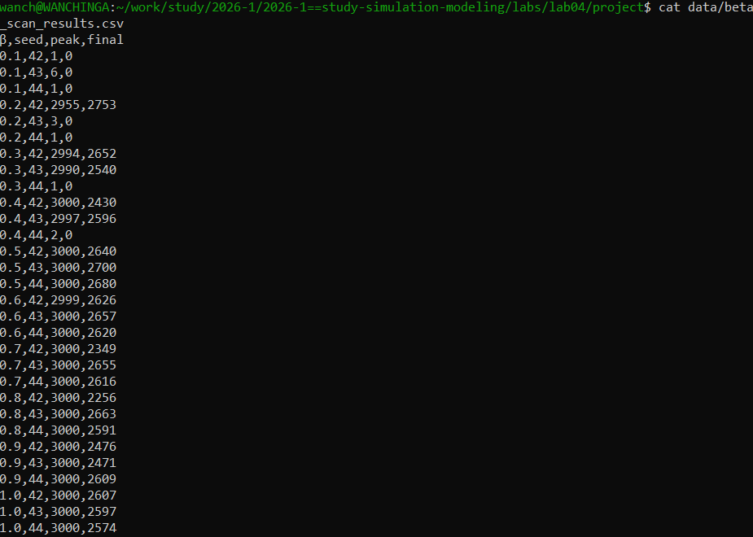

# Цель работы

Изучить агентную модель распространения инфекции SIR с использованием пакета Agents.jl.

# Задание

1. Реализовать агентную модель SIR.
2. Провести базовую симуляцию.
3. Исследовать влияние параметра β на динамику эпидемии.
4. Проанализировать результаты.

# Выполнение лабораторной работы

## Базовая симуляция

Была проведена базовая симуляция модели SIR с параметрами:
- Численность популяции: 3000 человек
- Начальное количество инфицированных: 1
- Период болезни: 14 дней
- Коэффициент заражения β: 0.5

### Запуск симуляции

{#fig-001 width=70%}

### График динамики SIR

{#fig-002 width=70%}

На графике видна классическая динамика эпидемии:
1. Рост числа инфицированных
2. Достижение пика
3. Последующее снижение

Результаты базовой симуляции:
- Пик инфицированных: 3000
- Конечное число инфицированных: 2640

## Параметрическое сканирование β

Было проведено сканирование параметра β (коэффициента заражения) в диапазоне от 0.1 до 1.0 с шагом 0.1. Для каждого значения β было выполнено 3 прогона с разными seed.

### Процесс сканирования

{#fig-003 width=70%}

### Результаты сканирования

{#fig-004 width=70%}

### График результатов

{#fig-005 width=70%}

# Выводы

В ходе работы была реализована агентная модель SIR на языке Julia с использованием пакета Agents.jl. Проведена базовая симуляция и параметрическое сканирование коэффициента заражения β. Результаты показывают, что увеличение β приводит к более высокой пиковой заболеваемости и большему числу переболевших. Модель демонстрирует пороговое поведение: при β < 0.2 эпидемия не развивается. Полученные результаты согласуются с теоретическими предсказаниями для модели SIR.

