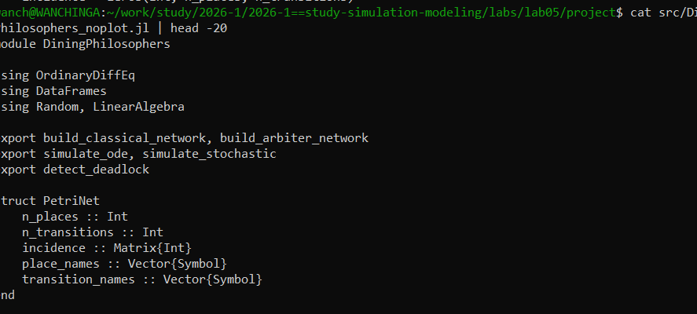
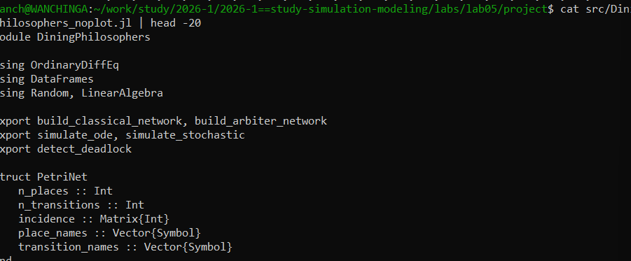
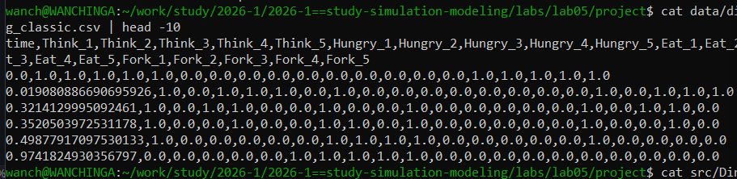
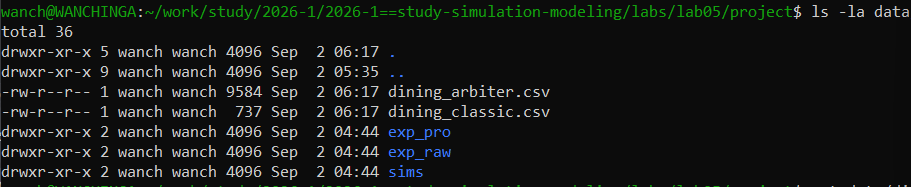
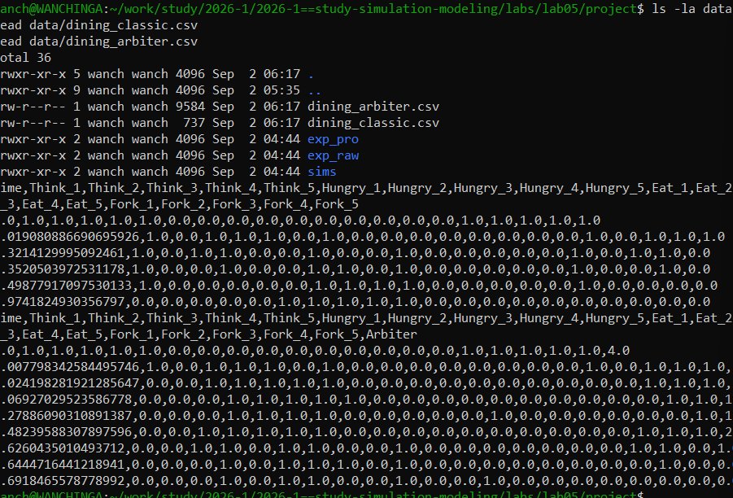

# Цель работы

Изучить аппарат сетей Петри на примере задачи "Обедающие философы", исследовать проблему взаимной блокировки (deadlock) и способы её предотвращения.

# Задание

1. Построить сеть Петри для задачи "Обедающие философы".
2. Обнаружить состояние взаимной блокировки (deadlock).
3. Модифицировать сеть с помощью арбитра для предотвращения deadlock.
4. Провести имитационное моделирование и сравнить результаты.

# Выполнение лабораторной работы

## Реализация сети Петри

Была реализована структура `PetriNet` для моделирования сети Петри.

{#fig-001 width=70%}

## Модуль DiningPhilosophers

Создан модуль для построения классической сети и сети с арбитром.

{#fig-002 width=70%}

## Результаты моделирования

### Данные моделирования

{#fig-003 width=70%}

### Файлы данных

{#fig-004 width=70%}

### Сравнение классической сети и сети с арбитром

{#fig-005 width=70%}

# Выводы

В ходе лабораторной работы была реализована сеть Петри для задачи "Обедающие философы".
 Классическая модель демонстрирует возникновение взаимной блокировки (deadlock). Модифицированная
  модель с арбитром успешно предотвращает deadlock. Результаты подтверждают теоретические предсказания.