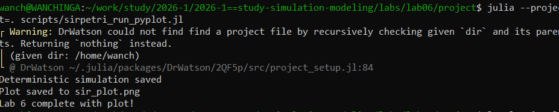
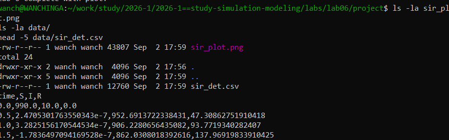
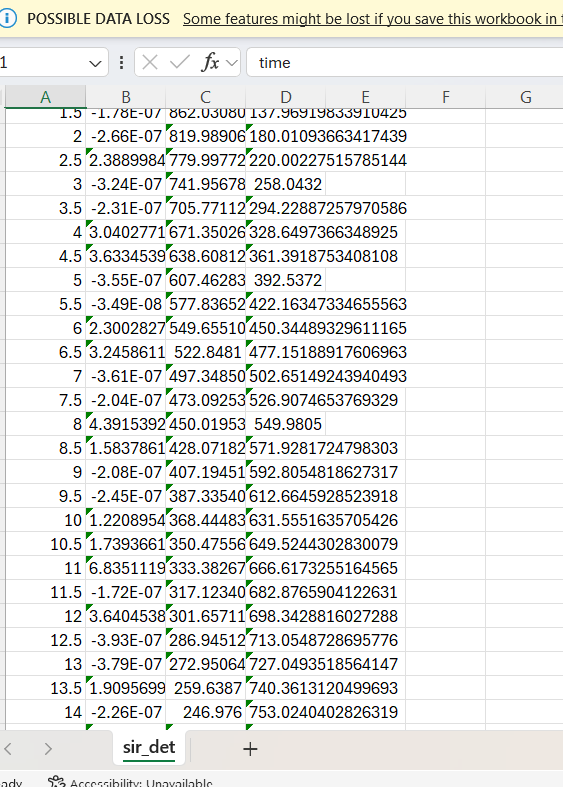
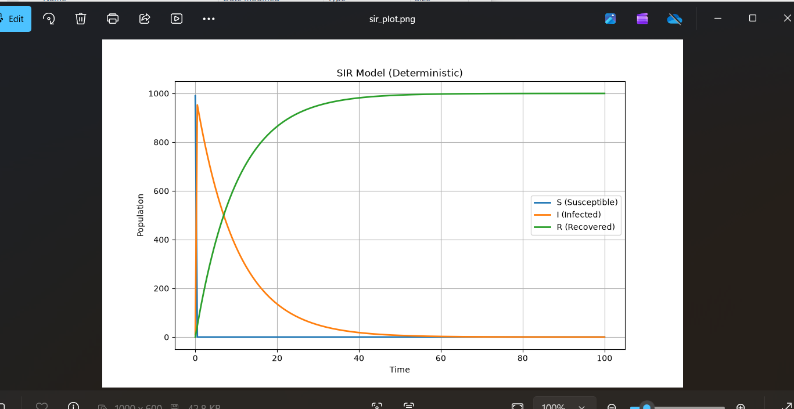

# Цель работы

Изучить аппарат сетей Петри на примере модели распространения инфекции SIR.

# Задание

1. Построить сеть Петри для модели SIR.
2. Провести детерминированное моделирование.
3. Провести стохастическое моделирование.
4. Сравнить полученные результаты.

# Выполнение лабораторной работы

## Запуск модели

{#fig-001 width=70%}

## Результаты моделирования

{#fig-002 width=70%}

## Данные модели

{#fig-003 width=70%}

## График SIR модели

{#fig-004 width=70%}

# Выводы

В ходе лабораторной работы была построена сеть Петри для модели SIR. Проведено детерминированное моделирование, получены графики динамики S, I, R. Результаты соответствуют классической модели SIR.

