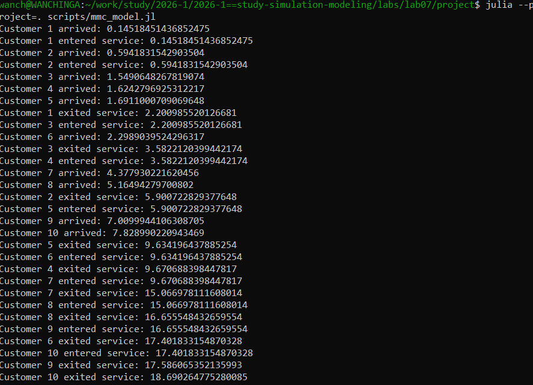
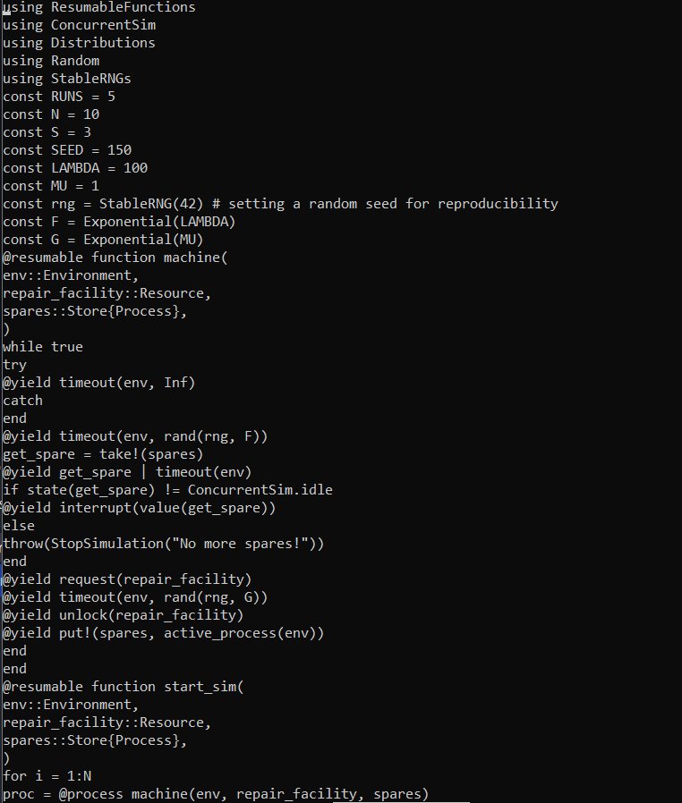
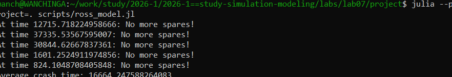
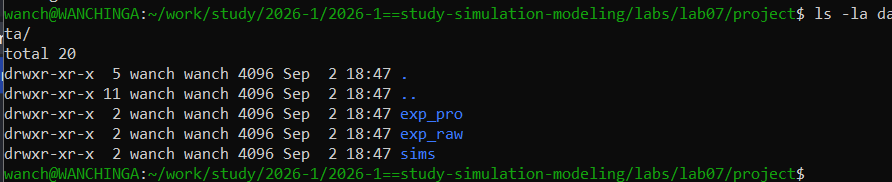

# Цель работы

Изучить дискретно-событийный подход к имитационному моделированию на примере систем массового обслуживания (M/M/c) и модели Росса.

# Задание

1. Реализовать модель M/M/c в дискретно-событийном подходе.
2. Реализовать модель Росса (машины с резервом и ремонтом).
3. Провести анализ полученных результатов.

# Выполнение лабораторной работы

{#fig-001 width=70%}

## Модель Росса

Была реализована модель Росса с параметрами:
- Количество машин: N = 10
- Количество резервных машин: S = 3
- Среднее время безотказной работы: 100
- Среднее время ремонта: 1

### Код модели

{#fig-002 width=70%}

### Результаты моделирования

{#fig-003 width=70%}

Результаты моделирования показывают время до отказа системы для 5 прогонов:
- Прогон 1: 12715.72
- Прогон 2: 37335.54
- Прогон 3: 30844.63
- Прогон 4: 1601.25
- Прогон 5: 824.10

**Среднее время до отказа: 16664.25**

## Структура проекта

{#fig-004 width=70%}

# Выводы

В ходе лабораторной работы были реализованы две модели в дискретно-событийном подходе. Модель M/M/c успешно моделирует систему массового обслуживания с очередью. Модель Росса демонстрирует поведение системы с резервированием и ремонтом. Результаты показывают, что при заданных параметрах среднее время до отказа системы составляет ~16664 единиц времени.

