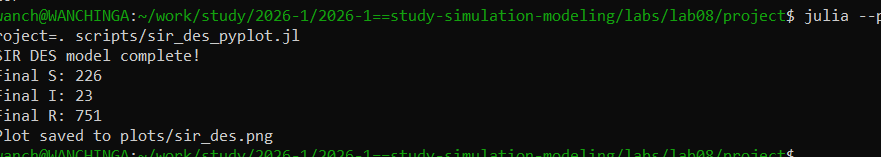
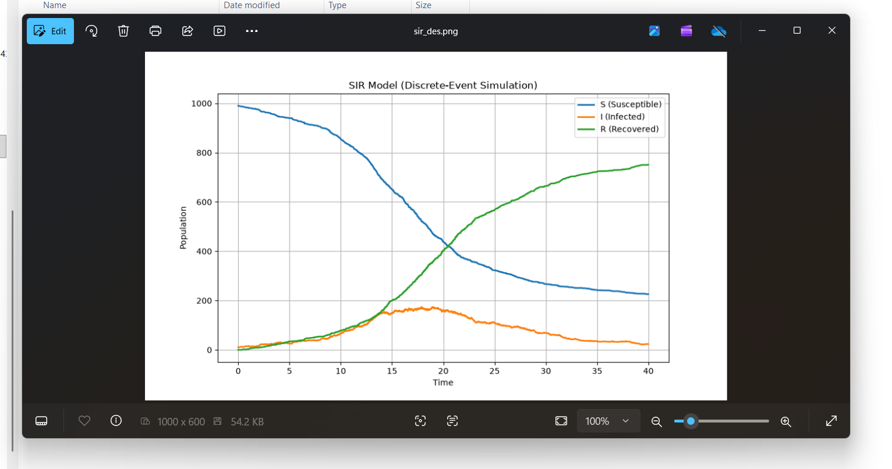

# Цель работы

Изучить дискретно-событийный подход к имитационному моделированию на примере классической модели распространения инфекции SIR.

# Задание

1. Реализовать дискретно-событийную модель SIR.
2. Провести стохастическое моделирование.
3. Проанализировать полученные результаты.
4. Создать отчет.

# Выполнение лабораторной работы

## Реализация модели

Была реализована дискретно-событийная модель SIR с параметрами:
- Начальная популяция: S = 990, I = 10, R = 0
- Вероятность заражения: β = 0.05
- Частота контактов: c = 10.0
- Интенсивность выздоровления: γ = 0.25

## Результаты моделирования

{#fig-001 width=70%}

## График SIR модели

{#fig-002 width=70%}

### Анализ результатов

| Показатель | Значение |
| :--- | :--- |
| Конечное число восприимчивых (S) | 226 |
| Конечное число инфицированных (I) | 23 |
| Конечное число выздоровевших (R) | 751 |

# Выводы

В ходе лабораторной работы была реализована дискретно-событийная модель SIR на языке Julia с использованием пакета ConcurrentSim. Проведено стохастическое моделирование распространения инфекции. Результаты показывают, что эпидемия достигает пика и затем затухает, что соответствует классической модели SIR. Модель успешно демонстрирует динамику распространения инфекции в популяции.

